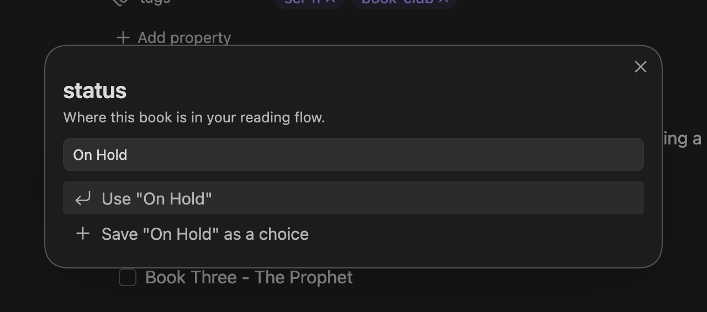

Three API methods work with [Auto Properties](/guides/auto-properties/): `autoprop` opens the same value prompt users see in the property picker, and `getAutoProperties` / `setAutoProperties` read and replace the configuration itself. This page covers their contracts and shows runnable Templater snippets; the guide covers the UI side.

All examples assume you have the API object:

```js
const api = app.plugins.plugins["metaedit"].api;
```

See the [API overview](/api/overview/) for access patterns and the error model.

## autoprop(propertyName)

```ts
autoprop(propertyName: string): Promise<string | string[] | null>
```

Looks up an enabled Auto Property whose name exactly equals `propertyName` (matching is case-sensitive; the first match wins) and opens its value prompt, including the property's description if one is set. It only prompts and returns the value - it never writes to a file. Pair it with [`update` or `createYamlProperty`](/api/properties/) when you want the result written somewhere.

| Return value | When |
| ------------ | ---- |
| `string` | The property's type resolves to Single |
| `string[]` | The property's type resolves to Multi |
| `null` | Auto Properties are disabled, no Auto Property with that name exists, or the user cancels the prompt |

:::caution[The master toggle gates this at runtime]
A perfectly configured Auto Property still returns `null` while the "Auto Properties" toggle is off in MetaEdit's settings. If your template suddenly stops prompting, check the toggle before debugging your code.
:::

Whether the prompt is single- or multi-select follows the property's configured type: an explicit Single or Multi is authoritative. When the property has no type (configurations saved before types existed), it inherits the global [Edit Mode](/reference/settings/): All Multi makes it multi-select, and Some Multi makes it multi-select when the property is listed there.

The prompt itself is interactive. If the user types a value that is not in the choice list, they can use it once or save it as a new choice, which persists into the Auto Property's configuration.



Because it opens a modal, `autoprop` needs a user at the keyboard. Do not call it from background jobs or event handlers that run without user interaction.

:::tip[Multi results in Templater]
A Multi property returns an array, so join it yourself in a template. The optional chaining keeps a cancelled prompt's `null` from crashing the template, and the `?? ""` fallback keeps the literal text `undefined` out of the note:

```js
<% (await autoprop("Tags"))?.join(", ") ?? "" %>
```
:::

## getAutoProperties()

```ts
getAutoProperties(): AutoProperty[]
```

Returns the configured Auto Properties. This method is synchronous - no `await` needed. Each entry has this shape:

```ts
{
  name: string,                 // exact property name the prompt matches on
  choices: string[],            // the selectable values
  description?: string,         // shown in the value prompt, only present when set
  type?: "Single" | "Multi"     // only present when set; absent inherits Edit Mode
}
```

The result is a defensive copy with the `choices` arrays cloned, so mutating it changes nothing in MetaEdit's settings. Use `setAutoProperties` to persist changes. The list is returned even while the Auto Properties feature toggle is off.

## setAutoProperties(autoProperties)

```ts
setAutoProperties(autoProperties: AutoProperty[]): Promise<void>
```

Replaces the entire Auto Properties list and saves settings. This is a full-list replace, not a merge: always start from `getAutoProperties()` and modify that copy, or you will silently drop every entry you did not include.

Input is validated up front, and the promise rejects with a `TypeError` naming the offending index when any rule fails:

- the argument must be an array of objects
- each entry must have a string `name`
- each entry's `choices` must be an array of strings
- `description`, when present, must be a string
- `type`, when present, must be `"Single"` or `"Multi"`

For example, passing a non-array rejects with `TypeError: Auto Properties must be an array.`

A few behaviors worth knowing:

- The input is deep-copied, so mutating your array after the call does not leak into settings. Keys other than `name`, `choices`, `description`, and `type` are silently discarded.
- Saves go through MetaEdit's serialized settings write queue, so a `setAutoProperties` call cannot race the settings tab or a choice the user saves from a prompt.
- It does not flip the Auto Properties feature toggle - it only replaces the list.

## Examples

### Add a choice to an existing property (Templater)

This snippet reads the current configuration, appends a new choice to the `status` property, and saves the list back. It is safe to run repeatedly - the guard skips the write when the choice already exists.

```js
<%*
const api = app.plugins.plugins["metaedit"].api;

const autoProps = api.getAutoProperties();
const status = autoProps.find((p) => p.name === "status");

if (status && !status.choices.includes("On Hold")) {
    status.choices.push("On Hold");
    await api.setAutoProperties(autoProps);
}
_%>
```

This works because `getAutoProperties()` hands you a copy you can edit freely before passing the whole list back to `setAutoProperties`.

### Prompt for two frontmatter fields (Templater)

A template that fills two frontmatter properties from Auto Property prompts as the note is created. The `?? ""` fallbacks keep cancelled prompts from writing a literal `null`, and the `[ ... ]` wrapper turns the joined Multi result into a real YAML list:

```md
<%*
const {autoprop} = this.app.plugins.plugins["metaedit"].api;
_%>
---
status: <% (await autoprop("status")) ?? "" %>
genres: [<% (await autoprop("genres"))?.join(", ") ?? "" %>]
---

# <% tp.file.title %>
```

For a complete task template built on `autoprop`, see [runnable examples](/api/examples/). For more template patterns, see the [Templater metadata prompts cookbook](/cookbook/templater-metadata-prompts/).
