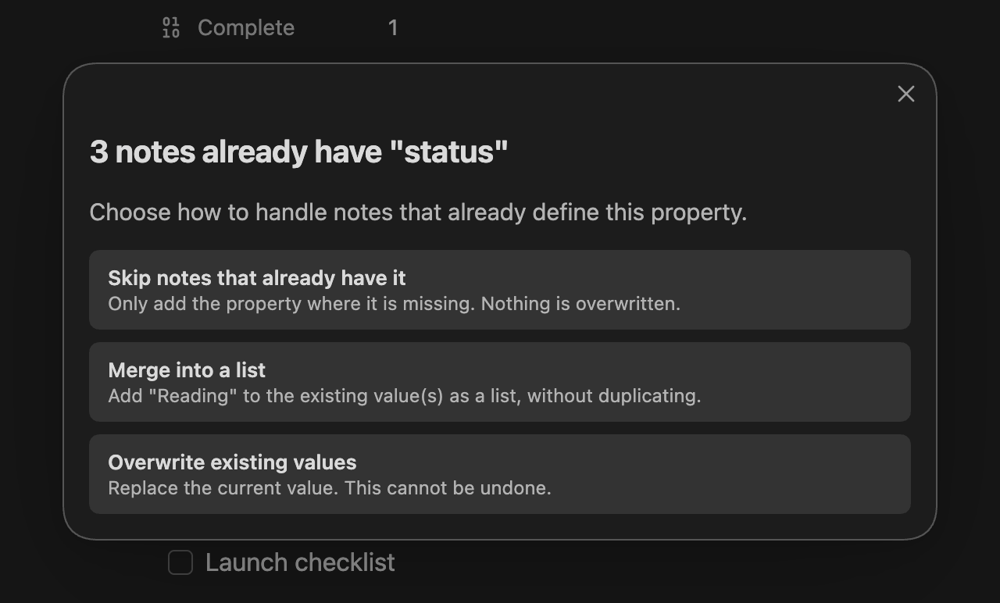
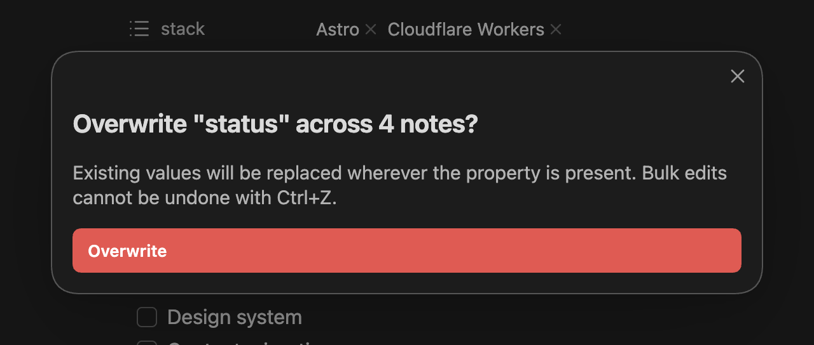

MetaEdit's bulk edit writes one YAML property across many notes in a single pass, with a conflict policy that decides what happens to notes that already have the key. This page turns the three policies into three migration recipes you can reuse: an additive stamp, a list merge, and a value standardization with a safety net.

If you have not used bulk edit before, the [bulk edit guide](/guides/bulk-edit/) covers the full flow. The short version: right-click a folder and choose "Bulk edit metadata in this folder (and subfolders)", or select several notes and choose "Bulk edit metadata in selected notes". There is no command palette entry - bulk edit is context-menu only, and both items live behind the "UI Elements" toggle in [settings](/reference/settings/) (on by default).


## Pick a policy

When some notes in scope already define the property, MetaEdit shows a chooser with three policies:



| Policy | What it does | Use it for |
| --- | --- | --- |
| "Skip notes that already have it" | "Only add the property where it is missing. Nothing is overwritten." | Additive stamps (recipe 1) |
| "Merge into a list" | Add the value to the existing value(s) as a list, without duplicating | Growing shared lists (recipe 2) |
| "Overwrite existing values" | "Replace the current value. This cannot be undone." | Standardizing values (recipe 3) |

If no note in scope has the key yet, the chooser is skipped and everything is an add. Pressing Escape in the chooser aborts the whole operation - nothing is written.

Two things bulk edit always does, regardless of policy: it writes YAML frontmatter only (never inline `key:: value` fields), and it honors your Edit Mode setting, so a key configured as multi-value is written as a one-element list just like a single-note add. It ignores Auto Properties and Edit Meta menu filtering entirely, and it is not undoable with Ctrl+Z.

## Recipe 1: stamp a type on a folder

Goal: every note in `Library/` gets `type: book`, without touching notes that already declare a type.

1. Right-click the `Library` folder and choose "Bulk edit metadata in this folder (and subfolders)". The prompt is scoped to every markdown note in the folder tree.
2. Enter `type` as the property name, then `book` as the value.
3. If the policy chooser appears, pick "Skip notes that already have it".

This is the safest bulk operation: purely additive, and idempotent. Notes that already carry a `type` come back as "skipped" and are not rewritten on disk - skip never compares values, so an existing `type: article` is left alone too. That means you can re-run the same stamp any time - for example after importing a new batch of notes - and only the newcomers change. A typical summary Notice:

```text
MetaEdit bulk "type": 12 added, 3 skipped across 15 notes.
```

## Recipe 2: merge a topic into existing lists

Goal: a set of notes scattered across folders all gain `productivity` in their `topics` list, whether they currently have no `topics`, a scalar `topics: focus`, or a full list.

1. In the file explorer, Ctrl/Cmd-click (or Shift-click) the notes to include. Folders in the selection are expanded recursively.
2. Right-click the selection and choose "Bulk edit metadata in selected notes".
3. Enter `topics`, then `productivity`.
4. Pick "Merge into a list".

Merge semantics worth knowing:

- Every note ends list-shaped. A missing `topics` is created as `topics: [productivity]`; a scalar is converted to a list before appending.
- Values are deduplicated: a note that already lists `productivity` is left alone and counted as "unchanged". Dedupe treats the number `5` and the string `"5"` as equal.
- A property whose current value is a map (nested object) is left untouched and counted as "skipped" - merge refuses to clobber structured data.

Like recipe 1, a merge run is idempotent: re-running it reports "unchanged" across the board.

## Recipe 3: standardize a value

Goal: notes with `status: WIP` should say `status: In Progress` instead.

Overwrite replaces the value on every note in scope that has the property, and adds it where missing - it does not know or care what the old value was. So the crucial move is scoping: select exactly the notes that should change, not the whole folder.

1. Find the affected notes. Obsidian's search handles this directly: search `[status:WIP]` to list every note whose `status` property is `WIP`. A Dataview table works too.
2. In the file explorer, multi-select exactly those notes, right-click, and choose "Bulk edit metadata in selected notes".
3. Enter `status`, then `In Progress`.
4. Pick "Overwrite existing values".
5. A confirmation modal appears, framed against the full selection size:



Click the red "Overwrite" button to proceed. Anything else - Escape, clicking away - aborts the entire operation.

:::caution[Back up before you overwrite]
As the modal says: "Existing values will be replaced wherever the property is present. Bulk edits cannot be undone with Ctrl+Z." Before a large overwrite, make a vault backup, commit your vault to git, or at minimum confirm Obsidian's File Recovery snapshots are on. An overwrite of an existing list flattens it to the new scalar value.
:::

Overwrite is still idempotent in the harmless direction: notes whose value already equals the new one count as "unchanged" and are not rewritten.

## Bonus: inline fields need Transform, not bulk

Bulk edit only writes YAML frontmatter. If some notes carry the property as an inline Dataview field (`status:: WIP` in the body), bulk edit does not see it - it would add a separate YAML `status` next to the inline one, leaving the note with two properties of the same name.

To migrate inline fields to YAML, use the per-row "Transform to YAML ⇄ Dataview" action instead: open the [property picker](/reference/commands-and-menus/) on the note ("MetaEdit: Run" or right-click, "Edit Meta"), hover the property's row, and click the transform icon. This is a note-by-note operation - there is no bulk transform - so treat inline-to-YAML migration as a gradual cleanup. Details in [delete and transform properties](/guides/delete-and-transform/).

## Read the summary, then the console

Every run ends with one Notice that stays up for 10 seconds, listing only the non-zero outcome buckets:

```text
MetaEdit bulk "status": 3 overwritten, 1 unchanged across 4 notes.
```

The buckets mean: "added" (key was missing and written), "merged" (appended into a list), "overwritten" (replaced), "skipped" (left alone by policy), "unchanged" (already had the value, no write), "failed" (write error). If nothing changed at all, the detail reads "no changes".

A failure on one note never aborts the batch. When any note fails, the Notice appends "(see console for failed notes)"; open the developer console (Ctrl+Shift+I, or ⌘+Option+I on macOS) to find a warning like:

```text
MetaEdit bulk: failed to update 2 note(s) for "status":
```

followed by the failing paths and error messages. Fix the notes (malformed frontmatter is the usual culprit) and re-run - the notes that already succeeded come back as "unchanged".
