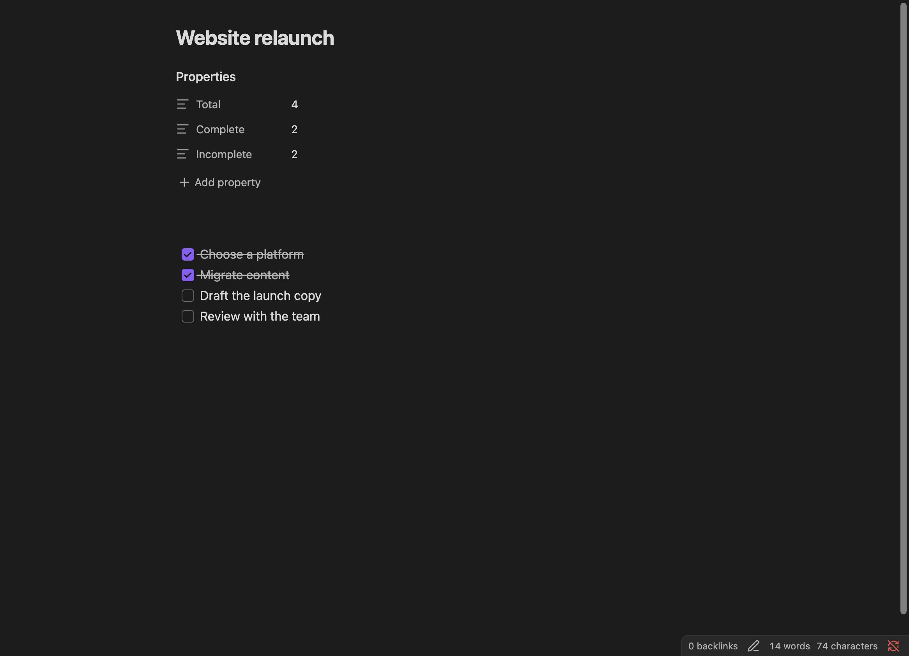

Build a dashboard note that lists every open task in your vault and completes any of them with one click, powered by MetaEdit's `update()` API. Then layer [Progress Properties](/guides/progress-properties/) on your project notes so task counts maintain themselves.

## Prerequisites

- MetaEdit 1.9.0 or later. The plugin requires Obsidian 1.12.7+ and works on desktop and mobile.
- The [Dataview](https://github.com/blacksmithgu/obsidian-dataview) community plugin with "Enable JavaScript queries" turned on in its settings (the dashboard is a `dataviewjs` block).
- The [Buttons](https://github.com/shabegom/buttons) community plugin for the first dashboard variant. The second variant uses a plain HTML button and needs no extra plugin.
- Optionally [Templater](https://github.com/SilentVoid13/Templater), if you want new task notes to prompt for their metadata.

## Step 1: shape the task notes

Each task is its own note, tagged `#tasks`, with inline Dataview fields in the body:

```md
#tasks

Status:: To Do
Project:: [[Website relaunch]]
Due Date:: 2026-07-15

- [ ] Draft the launch copy
- [ ] Review with the team
```

Two things matter about this shape:

- Seed `Status::` with a value. The API's `update()` only updates properties that already exist - on a note without a `Status` field it resolves silently and writes nothing.
- Dataview normalizes inline field names for queries: `Status::` is `t.status`, `Due Date::` is `t["due-date"]`.

You can create these by hand, or use a Templater template that prompts for the status as the note is created. The classic "New Task" template lives in [API examples](/api/examples/), and the prompting pattern is walked through in [Prompt for metadata in Templater templates](/cookbook/templater-metadata-prompts/).

## Step 2: the dashboard, Buttons variant

Create a `Task dashboard.md` note containing this `dataviewjs` block:

```dataviewjs
const {update} = this.app.plugins.plugins["metaedit"].api
const {createButton} = app.plugins.plugins["buttons"]

dv.table(["Name", "Status", "Project", "Due Date", ""], dv.pages("#tasks")
    .sort(t => t["due-date"], 'desc')
    .where(t => t.status != "Completed")
    .map(t => [t.file.link, t.status, t.project, t["due-date"], 
    createButton({app, el: this.container, args: {name: "Done!"}, clickOverride: {click: update, params: ['Status', 'Completed', t.file.path]}})])
    )
```

Every row of the table gets a "Done!" button. Clicking it calls `update("Status", "Completed", t.file.path)`, which rewrites the value of every `Status::` field in that task note. On the next Dataview refresh the `.where()` clause drops the row, so the dashboard only ever shows open work.

The API object is available at `app.plugins.plugins["metaedit"].api` whenever MetaEdit is enabled; see the [API overview](/api/overview/).

## Step 3: the dashboard, plain HTML variant

If you would rather not install Buttons, build the button yourself:

```dataviewjs
const {update} = this.app.plugins.plugins["metaedit"].api;
const buttonMaker = (pn, pv, fpath) => {
    const btn = this.container.createEl('button', {"text": "Done!"});
    const file = this.app.vault.getAbstractFileByPath(fpath)
    btn.addEventListener('click', async (evt) => {
        evt.preventDefault();
        await update(pn, pv, file);
    });
    return btn;
}
dv.table(["Name", "Status", "Project", "Due Date", ""], dv.pages("#tasks")
    .sort(t => t["due-date"], 'desc')
    .where(t => t.status != "Completed")
    .map(t => [t.file.link, t.status, t.project, t["due-date"], 
    buttonMaker('Status', 'Completed', t.file.path)])
    )
```

Same behavior, no extra plugin: a click awaits `update()` against the task's file.

## Why update() and not something else

`update(propertyName, propertyValue, file)` is the right call for a status flip:

- It replaces the value of every inline field named `Status` in the note, in place, leaving the rest of the line and all other content untouched. A status is one piece of state, so replace-all is exactly what you want.
- It never creates anything. A task note missing the field is silently skipped rather than polluted - which is why the template seeds `Status::` up front.
- Rapid clicks are safe: MetaEdit serializes all of its writes to a given file, so two button presses cannot race each other. See [Write safety](/concepts/write-safety/).

`appendDataviewField()` would be wrong here: it adds a new `Status:: ...` line and leaves the old one, so Dataview would then read `Status` as a list of two values and the `!= "Completed"` filter would misbehave. Reach for `appendDataviewField()` when you want to accumulate instances of a field (log entries, a growing wishlist), not replace state. Both methods are documented in [Properties API](/api/properties/).

## Step 4: automatic task counts on project notes

Each `Project::` field links to a project note. Give those notes live task counts with Progress Properties:

1. Open Settings, then MetaEdit, and turn on the "Progress Properties" toggle (description: "Update properties automatically.").
2. Click the row's extra button to expand the configuration table and click "Add" three times. Name the rows `Total`, `Complete`, and `Incomplete`, with the types "Total Tasks", "Completed Tasks", and "Incomplete Tasks" respectively.


3. Seed the three properties in each project note yourself - Progress Properties updates existing properties but never creates them:

```md
---
Total: 0
Complete: 0
Incomplete: 0
---

# Website relaunch

- [x] Choose a platform
- [x] Migrate content
- [ ] Draft the launch copy
- [ ] Review with the team
```

About 5 seconds after your last edit to the note, MetaEdit rewrites the counts - here `4`, `2`, and `2`:



:::caution[The rules the automator plays by]
Progress Properties (like the Kanban Board Helper) only processes markdown files that have YAML frontmatter, skips Excalidraw notes and unchanged content, and waits out a 5-second debounce that resets while you keep typing. It never creates a property - it only updates ones that already exist, matched by exact, case-sensitive name. Only `[x]` and `[X]` count as complete; custom markers like `[/]` or `[-]` count as incomplete.
:::

The full behavior, including counting rules and troubleshooting, is in the [Progress Properties guide](/guides/progress-properties/).

## Going further

- Drive project status from a Kanban board instead of buttons: [Kanban-driven project status](/cookbook/kanban-status-sync/).
- Prompt for `Status` and `Project` when a task note is created: [Prompt for metadata in Templater templates](/cookbook/templater-metadata-prompts/).
- The complete method reference: [Properties API](/api/properties/).
