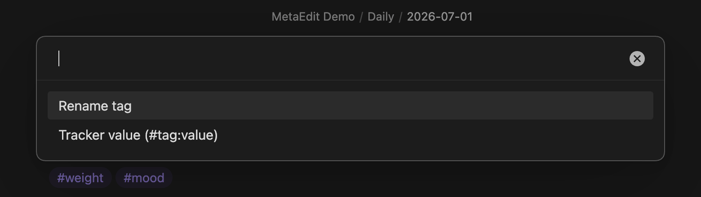
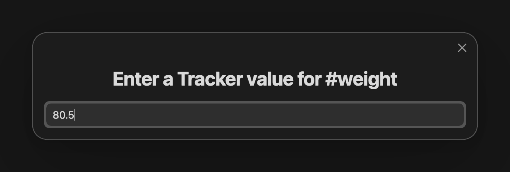

The [obsidian-tracker](https://github.com/pyrochlore/obsidian-tracker) plugin can chart numbers embedded in your notes as `#tag:value` tokens, such as `#weight:80.5`. MetaEdit gives you a fast way to write and update those tokens: pick the tag in the property picker, choose "Tracker value (#tag:value)", type the number. Re-editing replaces the old value instead of stacking, so a daily log stays clean.

## What you need

- MetaEdit 1.9.0 on Obsidian 1.12.7 or newer (desktop or mobile).
- The community obsidian-tracker plugin, installed and enabled.

The "Tracker value (#tag:value)" action only exists when Tracker is installed. MetaEdit checks for it once, when the plugin loads - if you install Tracker mid-session, disable and re-enable MetaEdit (or restart Obsidian) so the action appears.

## Step 1: seed your daily notes with bare tags

Put the tags you want to track into your daily note template, so every day starts with them ready to fill in:

```md
# {{date}}

#weight #mood

## Log
```

This works with the core Daily notes template or Templater. If you use Templater for richer metadata capture, see [prompt for metadata in Templater templates](/cookbook/templater-metadata-prompts/).

Two placement rules: these must be body tags (a frontmatter `tags:` property never gets a `:value` suffix), and tags inside code blocks are invisible to MetaEdit because Obsidian's metadata cache does not index them.

## Step 2: log today's value

1. Open today's note and run "MetaEdit: Run" from the command palette (or right-click the note and choose "Edit Meta").
2. Pick the `#weight` row. Every tag occurrence gets its own row, so if the same tag appears twice you will see rows like `#weight (line 3, 1/2)` - pick the occurrence you mean.
3. An action chooser opens. With Tracker installed, a flat tag like `#weight` offers "Rename tag" and "Tracker value (#tag:value)". Choose "Tracker value (#tag:value)".



4. A prompt titled "Enter a Tracker value for #weight" appears. Type `80.5` and press Enter.



The tag in your note becomes:

```md
#weight:80.5 #mood
```

Only that exact tag occurrence is rewritten - the rest of the line and the note stay byte-for-byte intact. See [how MetaEdit writes to your notes](/concepts/write-safety/) for why that matters.

Nested tags add an "Edit last segment" row to the chooser, and without Tracker a flat tag skips the chooser entirely and goes straight to renaming - the full set of tag actions is covered in [edit tags](/guides/edit-tags/).

## Step 3: correct or update a value

Weighed in again after coffee? Run the same flow on the `#weight` row (the `:80.5` suffix is Tracker data, not part of the tag, so the row still reads `#weight`) and enter the new number. MetaEdit replaces the existing suffix rather than appending:

```text
#weight:80.5  ->  #weight:81
```

never `#weight:81:80.5`. The replacement is bounded to the value token itself, so adjacent punctuation survives: editing `#weight:80,` or `(#weight:80)` keeps the comma and the parenthesis.

Rules for the value:

- Allowed characters are letters, digits, and `. _ + -`. No spaces - a Tracker value is a single token, typically a number.
- Submitting an empty value cancels the edit; nothing is written.
- The choice of Tracker mode applies to that one edit only. The next time you edit a tag you pick the action again.

## Step 4: chart it

Add a Tracker code block to any dashboard note. Tracker's tag search reads the `:value` suffix from every `#weight:value` occurrence:

````md
```tracker
searchType: tag
searchTarget: weight
folder: Daily
startDate: 2026-06-01
endDate: 2026-06-30
line:
    title: Weight
    yAxisLabel: kg
```
````

Adjust `folder` to wherever your daily notes live. Add a second block for `#mood`, or track both in one chart with a comma-separated `searchTarget` - see the Tracker plugin's documentation for its full query syntax.

## Limits worth knowing

- Body tags only. Frontmatter tags are ordinary YAML values; MetaEdit never writes Tracker syntax into a `tags:` property.
- One occurrence per edit. MetaEdit edits the exact tag you picked, in that note. Vault-wide tag operations belong to Obsidian's Tag pane, as the picker footer says: "#tag - rename in this note · vault-wide: Tag pane".
- If the note changed under you between opening the picker and confirming (for example, from a sync conflict), MetaEdit refuses the write with an error notice instead of guessing - reopen the picker and try again. The exact messages are listed in [notices and error messages](/reference/notices/).
