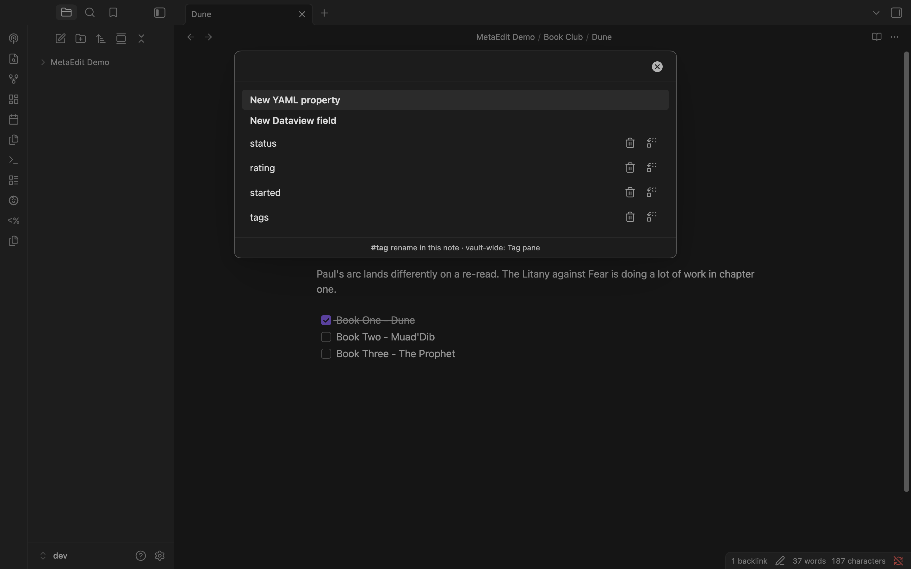
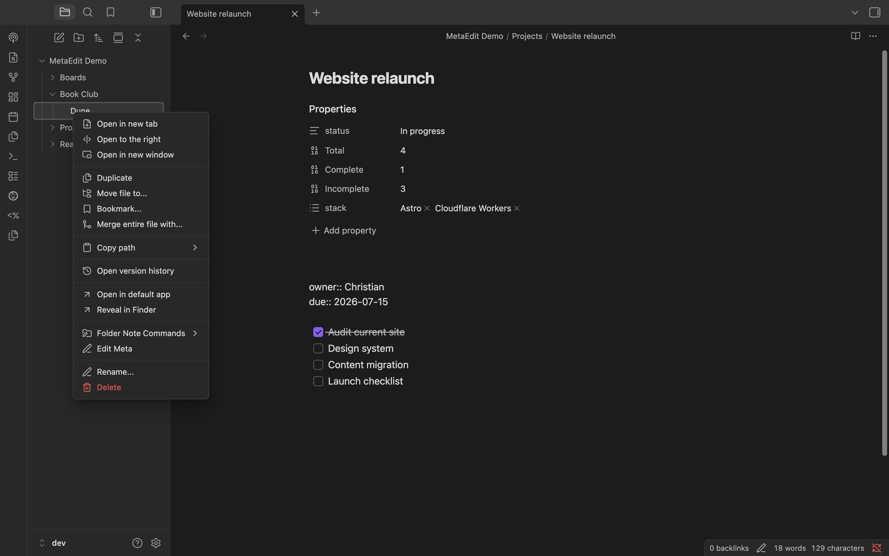

In five minutes you'll edit an existing property, create a new one, and know every way to reach MetaEdit. All you need is the plugin [installed](/getting-started/installation/) and a note with some metadata - the examples below use book notes with properties like `status`, `started`, `rating`, and a couple of tags, but any note works.

## 1. Run MetaEdit on a note

Open a note, then open the command palette (`⌘/Ctrl+P`) and run **MetaEdit: Run**.

:::tip
You'll use this command constantly - bind it to a hotkey under **Settings** -> **Hotkeys**.
:::

:::caution
With no active markdown note - say a PDF or canvas is focused, or nothing is open - the command silently does nothing. The only trace is a message in the developer console. Focus a markdown note and run it again.
:::

## 2. Meet the property picker

The command opens the property picker, MetaEdit's central menu:

From top to bottom:

- Two bold action rows: **New YAML property** and **New Dataview field**.
- Every editable piece of the note's metadata, in the order MetaEdit reads it: body `#tags`, YAML frontmatter properties, then inline Dataview fields (`key:: value`).
- On property rows, two action icons with hover tooltips: "Delete property" and "Transform to YAML ⇄ Dataview". More on those in [Delete and transform properties](/guides/delete-and-transform/).
- A footer hint about tags: "#tag - rename in this note · vault-wide: Tag pane". MetaEdit edits tags inside this note; vault-wide renames belong to Obsidian's Tag pane.

It's a fuzzy search: type to filter, use the arrow keys to move, press Enter to pick, Esc to close.

## 3. Edit a property

Pick the `started` property. Because `started` is a date, MetaEdit opens an "Edit started" modal containing Obsidian's own date picker - the same widget the Properties panel uses:

Pick a date and select **Save**. The value is written to the note's frontmatter as a real date, not a retyped string. **Cancel** closes without touching the file, and saving an unchanged value writes nothing at all.

Every property type gets its matching widget: a number field for `rating`, chips for lists, a checkbox for booleans. See [Edit properties with native widgets](/guides/edit-properties/) for the full picture, including what happens for [Auto Properties](/guides/auto-properties/) and inline fields.

## 4. Create a property

Run **MetaEdit: Run** again and pick **New YAML property**. A single "New property" modal opens, and it's type-aware:

- The key input autocompletes from every property name in your vault.
- The value widget follows the type: type a key your vault already knows, like `rating`, and the row switches to the number widget on its own.
- `⌘/Ctrl+Y` opens the type menu; `⌘/Ctrl+↵` adds the property.

That's the short version - [Create new properties](/guides/create-properties/) covers type inference, the type menu, and the **New Dataview field** row for inline fields.

## 5. Or start from a right-click

You don't need the note open. Right-click any `.md` file in the file explorer, or any internal link in a note, and choose **Edit Meta**:

It opens the same property picker, targeted at that file. Folders and multi-selections get bulk-edit items instead - see [Bulk edit metadata across notes](/guides/bulk-edit/).

## Where to next

- [How metadata works in Obsidian](/concepts/metadata-in-obsidian/) and [what MetaEdit can (and can't) edit](/concepts/what-metaedit-can-edit/) for grounding.
- [Edit properties with native widgets](/guides/edit-properties/) and [work with lists](/guides/lists-and-multi-values/) for everyday editing.
- [Auto Properties](/guides/auto-properties/) to stop retyping the same values.
- [Commands and menus](/reference/commands-and-menus/) for the complete list of entry points.
