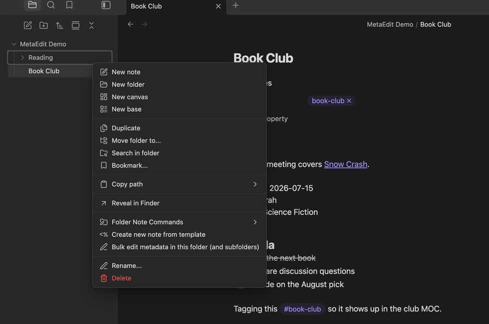
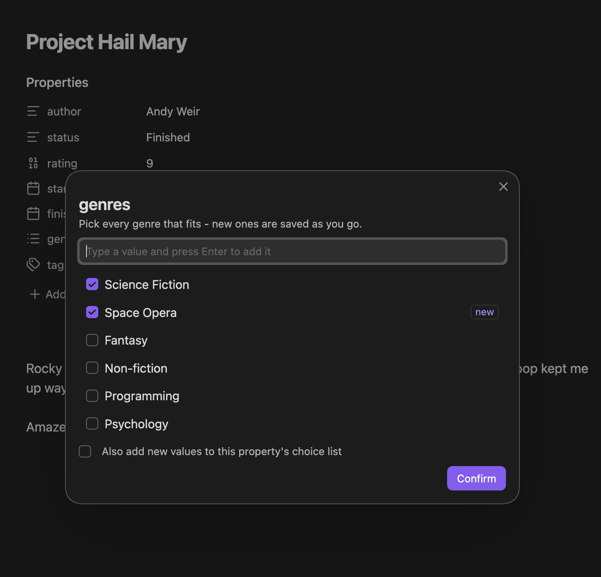

MetaEdit 1.9.0 is the biggest release in years. Property editing now happens through Obsidian's own property widgets, new properties are created in one fluid, type-aware modal, and you can edit metadata across a whole folder in one pass. Auto Properties grew multi-select, descriptions, and learn-as-you-go values. Underneath it all, five months of hardening make every write safer than it has ever been.

:::caution[Requires Obsidian 1.12.7 or newer]
MetaEdit now requires **Obsidian 1.12.7 or newer** - the new editing experience is built directly on Obsidian's modern properties engine. Vaults on older Obsidian versions keep receiving 1.8.4 from the plugin updater. See [Breaking changes](#breaking-changes) below for the full list.
:::

## Edit properties with Obsidian's native widgets

Pick a property from the [property picker](/getting-started/quick-start/) and you now get the exact widget Obsidian's Properties panel would give you: a date picker for dates, a checkbox for booleans, chips for lists, a number field for numbers. No more retyping structured values as free text - types are respected end to end, so `rating` stays a number and `started` stays a real date, both in the editor and in the file.

Read more in [Edit properties with native widgets](/guides/edit-properties/).

## Create properties fluidly - types included

**New YAML property** opens a single row that behaves like Obsidian's own property editor:

- The key input autocompletes from every property name in your vault.
- The value widget follows the type: type a known key like `rating` and the row switches to the number widget on its own; `finished` mounts a date picker.
- Type a value that *looks* like a date or number under the wrong type, and MetaEdit offers a one-click "Change to Date/Number" switch.
- Keyboard-first: `⌘/Ctrl+Y` opens the type menu, `⌘/Ctrl+↵` adds the property.

Keys with an Auto Property hand you off to its value prompt, and `tags`/`aliases` lock to their reserved types so you can't create malformed frontmatter. Full details in [Create new properties](/guides/create-properties/).

## Bulk edit metadata across folders and selections



Right-click any folder and choose "Bulk edit metadata in this folder (and subfolders)", or multi-select notes in the file explorer and choose "Bulk edit metadata in selected notes". Name a property, give it a value, and if some notes already define it, choose exactly what happens:

- **Skip notes that already have it** - nothing is overwritten,
- **Merge into a list** - without duplicating, or
- **Overwrite existing values** - behind an explicit confirmation, because bulk edits can't be undone with `Ctrl+Z`.

A summary notice reports what changed. Every write goes through MetaEdit's [serialized write queue](/concepts/write-safety/), so a bulk run can't race your other edits. See [Bulk edit metadata across notes](/guides/bulk-edit/).

## Auto Properties leveled up



Auto Properties - predefined value lists for properties you edit often - learned some serious new tricks:

- **Multi-select**: mark an Auto Property as **Multi** and pick several values with checkboxes; they're written as a proper YAML list.
- **Descriptions**: add an optional note that shows up in the value prompt, so future-you remembers what the property means.
- **Learn as you go**: type a value that isn't in the list to use it once, or save it into the choices right from the prompt - no trip to settings.
- **Paste a list**: paste comma- or newline-separated values into a choice field in settings and it splits into one choice per entry.

Everything is covered in [Auto Properties: reusable value sets](/guides/auto-properties/).

## Smarter value entry everywhere

Text prompts now autocomplete from your vault: property values are suggested ranked by how often you already use them, and [tag edits](/guides/edit-tags/) suggest your existing tags. Date- and datetime-typed properties get a native picker instead of a bare text box.

## A cleaner, more capable menu

- Every YAML/Dataview row has native, tooltipped actions: "Delete property", or "Transform to YAML ⇄ Dataview", right from the list. See [Delete and transform properties](/guides/delete-and-transform/).
- **Hide file tags** from the picker (Settings -> "Edit Meta menu") when you only care about frontmatter and inline fields - a frontmatter `tags:` property stays editable.
- Hide specific properties by name via the same [filtering settings](/reference/settings/).
- Nested YAML shows up as individual child rows, so structured frontmatter is no longer a wall of text.

## Tags are edited where they live

Tag editing was rebuilt for correctness: rename a body `#tag` occurrence in place, or edit a frontmatter `tags:` list as a real list - MetaEdit strips stray `#` prefixes, accepts single values or comma/space-separated strings, and removes the key when you clear the last tag. Because body tags could not be deleted or transformed safely, those two actions were removed for body tags; "Rename tag" and "Edit last segment" stay. Vault-wide renames remain Obsidian's Tag pane territory. See [Edit tags](/guides/edit-tags/).

## For plugin developers and Templater users

The [public API](/api/overview/) (`app.plugins.plugins["metaedit"].api`) grew a lot this cycle:

```js
const api = app.plugins.plugins["metaedit"].api;

// Nested YAML paths - read, update, or create-with-parents
await api.addOrUpdateYamlPath("book.progress.page", 217, file);
const page = await api.getYamlPath("book.progress.page", file);

// Append a NEW inline Dataview field instance (never replaces existing ones),
// with control over where it lands
await api.appendDataviewField("review", "pending", file, { location: "end" });

// Read every property in a file - YAML (incl. nested), inline fields, tags
const props = await api.getPropertiesInFile(file);

// Manage Auto Properties programmatically
const autoProps = api.getAutoProperties();
await api.setAutoProperties([...autoProps, { name: "mood", choices: ["good", "neutral", "bad"] }]);

// Subscribe to real metadata changes (no-op edits are filtered out)
const unsubscribe = api.onMetadataChange(({ file, properties, previousProperties }) => {
  console.log(`${file.path} metadata changed`);
});
```

New in 1.9.0:

- `getYamlPath` / `updateYamlPath` / `addOrUpdateYamlPath` - [nested paths](/api/yaml-paths/) with `a.b[0].c` syntax
- `appendDataviewField` with insert-location options and `getPropertiesInFile` - [reading and writing properties](/api/properties/)
- `getAutoProperties` / `setAutoProperties` - the [Auto Properties API](/api/auto-properties/)
- `onMetadataChange` - the [metadata change subscription](/api/events/)

## Reliability roundup

A lot of this release is invisible: it's the writes that *don't* go wrong anymore.

- **Inline fields**: updates no longer append stray brackets, fields behind list/quote markers and brackets are parsed, writes are fence-aware so `key:: value` inside code blocks is left alone, and `[[wikilinks]]` survive multi-value edits.
- **YAML lists** (including `tags`) are edited as native lists instead of being collapsed to a string, and malformed frontmatter no longer breaks parsing.
- **Kanban helper**: only the card's leading link is synced - trailing date/reference links are ignored; ambiguous same-named notes are never written to; a missing board property produces a single notice instead of spam.
- **Progress Properties** count only `[x]`/`[X]` tasks as complete.
- **Safety**: `__proto__`/`constructor`/`prototype` are rejected as property keys everywhere, and frontmatter writes are hardened.
- **No lost updates**: settings and bulk writes are [serialized through write queues](/concepts/write-safety/), and the settings tab no longer clobbers concurrently added Auto Property choices.

## Breaking changes

:::caution[Behavior changes to know about]
- **Requires Obsidian 1.12.7+** - the minimum Obsidian version was raised from 1.4.1.
- **Body-tag delete and transform actions were removed** - they could not target the right text safely. "Rename tag" and "Edit last segment" remain, and frontmatter `tags:` editing is unaffected.
- **Tag rename replaces the whole tag.** The legacy flow appended your input as a child segment, turning `#book` plus `fantasy` into `#book/fantasy`; since 1.9.0, a flat tag is renamed, never nested - type the full nested name (`book/fantasy`) to nest. See [Edit tags](/guides/edit-tags/).
- The property picker's row actions now use Obsidian's native icons and tooltips - same actions, clearer presentation.
:::

## Full changelog

See the [changelog](/help/changelog/) for release-by-release history, or every commit since 1.8.4 on GitHub: [`1.8.4...1.9.0`](https://github.com/chhoumann/MetaEdit/compare/1.8.4...1.9.0).
