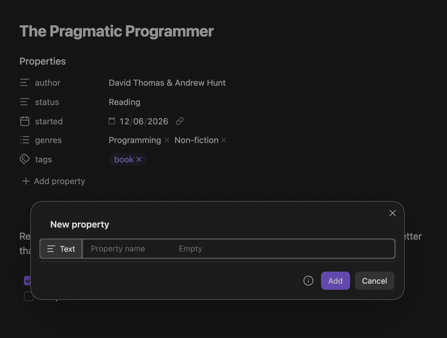
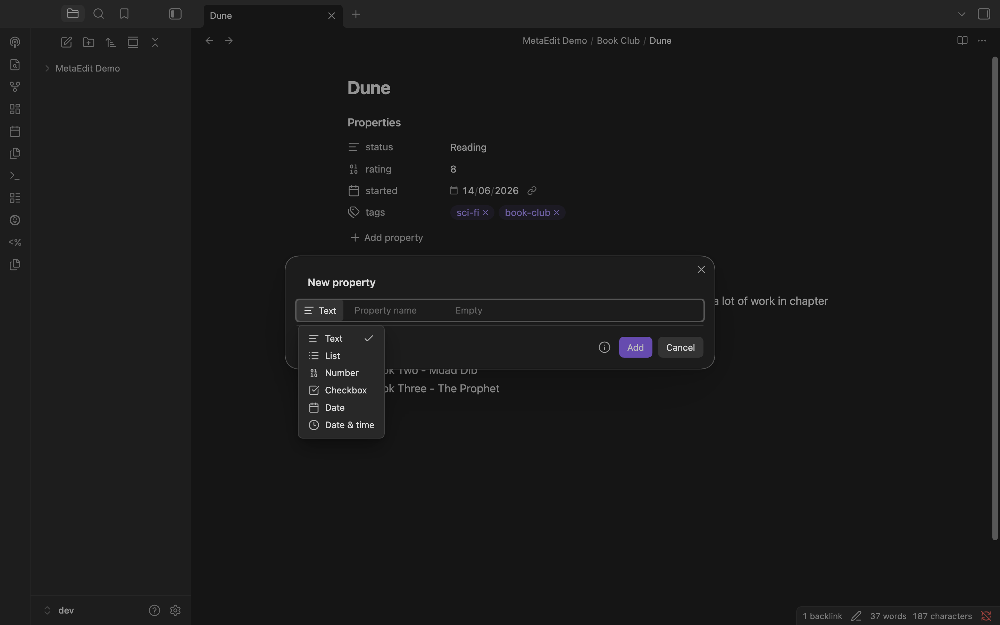
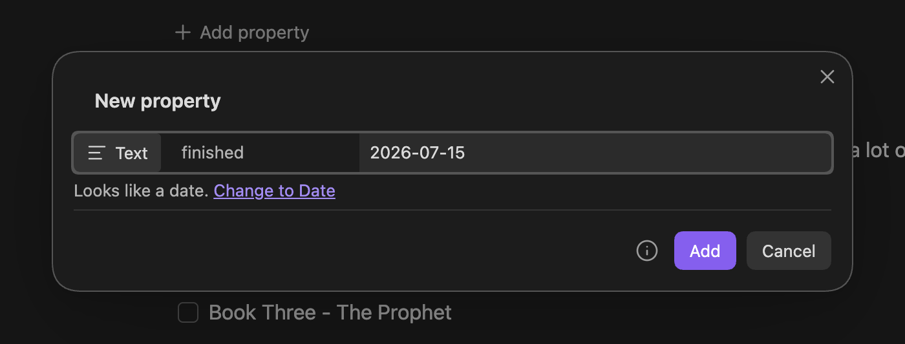
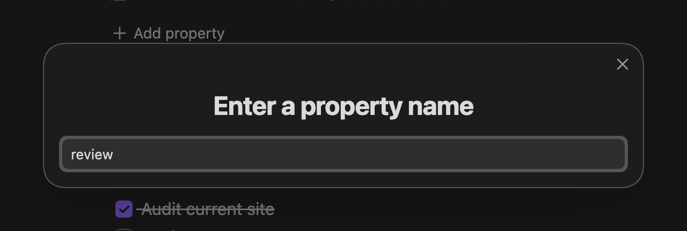

The top of the property picker offers two creation rows: "New YAML property" opens a single type-aware modal that writes a typed frontmatter property, and "New Dataview field" appends an inline `key:: value` field to the note body. This page covers both.

## New YAML property

Run "MetaEdit: Run" (or right-click a note and choose "Edit Meta"), then pick "New YAML property". A modal headed "New property" opens - one row that mirrors Obsidian's own add-property row:

The row has three parts:

- A clickable **type pill** showing the current type's icon and label.
- A **key input** with the placeholder "Property name".
- An **adaptive value area** that mounts Obsidian's native widget for the current type - initially Text, empty.

The footer holds an "Add" button, a "Cancel" button, and an info icon whose tooltip reads "⌘/Ctrl+↵ to add · ⌘/Ctrl+Y to change type".

### Key autocomplete

As you type the name, a dropdown suggests property names already used anywhere in your vault plus your configured [Auto Property](/guides/auto-properties/) names. Keys the note already has are excluded - including ones hidden from the picker by the ["Edit Meta menu" filters](/reference/settings/) - so you are never offered a name that would be rejected as a duplicate.

### Automatic type adoption

When the key settles (press Enter or Tab, or click into the value area), a key your vault already knows adopts its stored type using Obsidian's vault-wide type memory. Type `rating` in a vault where `rating` is a number and the value area switches to the Number widget on its own, as the animation above shows. A brand-new key stays Text.

Three names lock their type outright: `tags` (and the singular `tag`) and `aliases` always use their Obsidian widget. The type pill is disabled for them, with the tooltip "{Label} (fixed for this property)" - you can never make `tags` a Number. The name `cssclasses` adopts the List widget without locking.

### Picking a type by hand

Click the type pill, or press `⌘/Ctrl+Y`, to open the type menu:

The six choices are Text, List, Number, Checkbox, Date, and Date & time, with the current type checked. Once you pick a type manually it is pinned: key adoption and inference stop overriding it. Switching type carries your in-progress text across wherever the target type can represent it - `42` survives a switch to Number, `2026-07-15` survives a switch to Date - and switching back to Text is always lossless.

### The inference hint

While the type is Text (and not pinned), MetaEdit watches what you type. If the value looks like a richer type, a hint appears under the row:

The hint reads "Looks like a {type}." followed by a "Change to {Type}" link that switches (and pins) the type, keeping your typed value.

| You typed | Suggested type |
| --- | --- |
| A calendar-valid ISO date and time, like `2026-07-15T09:30` | Date & time |
| A calendar-valid ISO date, like `2026-07-15` | Date |
| Exactly `true` or `false` | Checkbox |
| A plain decimal number, like `42` or `-0.5` | Number |

Inference is promotion-only and always opt-in: it never changes the type by itself, never fires once you are on a non-text type, and never suggests List from commas - a text value can legitimately contain commas, so you pick List explicitly. It is deliberately conservative: leading-zero numbers like `007` stay text, as do scientific notation, values with trailing text like `3 apples`, and impossible dates like `2026-99-99`.

### Keyboard reference

| Keys | Action |
| --- | --- |
| Enter (in the key input) | Pick the highlighted suggestion when the dropdown is open; otherwise settle the key and jump to the value editor |
| Tab (in the key input) | Settle the key as typed and jump to the value editor - Tab never picks from the dropdown |
| `⌘/Ctrl+Y` | Open the type menu |
| `⌘/Ctrl+↵` | Add the property, from anywhere in the modal |
| Enter (in the value editor) | Adds the property only in single-line editors (Number, Date, Date & time); in the text and chip editors, Enter belongs to the widget |
| Escape | Cancel without writing |

### Validation

The "Add" button is disabled, with a warning shown, whenever the key is not creatable:

- A reserved name (`__proto__`, `constructor`, `prototype`) shows `"{key}" is a reserved property name and can't be used.` These keys are refused on [every YAML write path](/concepts/write-safety/).
- A key the note already has shows `This note already has a property named "{key}".` Hidden-but-present keys count too.

If the key is added to the note between opening the modal and pressing "Add" - by another plugin or a sync - nothing is overwritten: MetaEdit re-checks inside the write and shows "Frontmatter in file '{filename}' already has property '{key}'. Will not add."

### What gets written

"Add" writes the widget's value as a new top-level frontmatter key, with the chosen type authoritative: a List is a real YAML list, a Number a real number. An untouched widget commits that type's empty value - empty text for Text, Date, and Date & time, `null` for Number, `false` for Checkbox, `[]` for List. "Cancel" or closing the modal writes nothing.

:::note[Edit Mode does not apply here]
The [Edit Mode setting](/guides/lists-and-multi-values/) never wraps or reshapes values created through this modal - List is the explicit array path. Edit Mode governs inline fields, non-native YAML scalars, and the legacy add paths (transform-to-YAML, the API's `createYamlProperty`, and bulk adds).
:::

:::tip[Auto Property handoff]
If the key you type has an active Auto Property, the type pill and value editor disappear and a note explains the handoff: `"{key}" uses an Auto Property – press ⌘/Ctrl+↵ to choose its value.` Committing opens the [Auto Property value prompt](/guides/auto-properties/) instead, which writes through the legacy path and so keeps the Auto Property's Single or Multi shape. Cancelling that prompt writes nothing.
:::

## New Dataview field

The picker's second creation row, "New Dataview field", adds an inline `key:: value` field to the note body through two plain prompts: "Enter a property name", then "Enter a property value".

The name prompt autocompletes from the same pool as the YAML modal. If the name has an active Auto Property, its value prompt supplies the value instead of the free-text prompt. Cancelling either prompt aborts silently; the typed value is trimmed before writing.

Placement is deliberate:

- The new line lands right after the last existing field with the same name, so repeated fields stay grouped.
- If the note has no such field, it goes at the end of the body.
- It is never inserted inside YAML frontmatter or a fenced code block.

Each run appends a new field instance and leaves existing same-named fields untouched. To change an existing field's value, [edit it](/guides/edit-properties/) instead - an inline-field edit updates every instance of that name.

## Related pages

- [Edit properties with native widgets](/guides/edit-properties/) - what happens after the property exists.
- [Work with lists and multi-value properties](/guides/lists-and-multi-values/) - list values and the Edit Mode setting.
- [Delete and transform properties](/guides/delete-and-transform/) - convert a field between YAML and Dataview form.
- [Reading and writing properties](/api/properties/) - create properties from other plugins or scripts.
