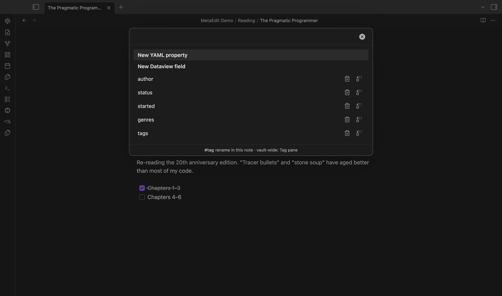

Every editable property row in the property picker carries two action icons: a trash icon that deletes the property, and a transform icon that converts it between YAML frontmatter and an inline Dataview `key:: value` field. This page explains exactly what each action writes, which rows offer them, and what the safety notices mean.

## The row action icons

Open the picker with "MetaEdit: Run" or the right-click "Edit Meta" menu item, then hover (or tap) a property row:



| Icon | Tooltip | What it does |
| --- | --- | --- |
| Trash | "Delete property" | Removes the property from the note |
| Replace arrows | "Transform to YAML ⇄ Dataview" | Converts YAML frontmatter to an inline field, or an inline field to YAML frontmatter |

Both icons are click or tap only - there is no keyboard shortcut for them. Selecting the row itself (Enter or click on the row text) still opens the normal [edit flow](/guides/edit-properties/).

Not every row offers the icons:

| Row type | Icons shown |
| --- | --- |
| Top-level YAML property | Yes |
| Inline Dataview field | Yes |
| Body `#tag` | No - tags have no `key:` line to delete or transform; see [edit tags](/guides/edit-tags/) |
| Nested or dot-path YAML row (like `author.name`) | No - a nested leaf cannot be safely removed as a unit yet |

## Delete a property

Click the trash icon ("Delete property"). What gets removed depends on where the property lives:

- **A YAML property** is removed whole, through Obsidian's frontmatter primitive. A multi-line block value - a block list or a nested map - is deleted together with its key, never leaving orphaned `- item` lines behind.
- **An inline Dataview field** is removed by deleting the first line in the note that matches `key::`. The `::` separator is required for the match, so a same-named YAML `key:` line in frontmatter is never touched.

The picker closes after a delete, even if the write fails - reopen it to see the current state.

:::note[Duplicate inline fields]
Deleting an inline field removes only the first matching `key::` line. If the note declares the same field on several lines, run the delete once per line, from the top down.
:::

## Transform between YAML and inline

Click the transform icon ("Transform to YAML ⇄ Dataview"). The direction is determined by where the property currently lives:

**YAML to inline.** The key is removed from frontmatter and appended to the note body as a `key:: value` line. A YAML list is flattened into a single comma-joined string: `genres: [sci-fi, fantasy]` becomes `genres:: sci-fi, fantasy`.

**Inline to YAML.** The `key::` line is removed and the key is added to frontmatter through MetaEdit's standard add path, which means:

- [Edit Mode](/reference/settings/) wrapping applies: under "All Multi", or "Some Multi" with the key listed, the value is stored as a one-element YAML list.
- A field named `tags` or `tag` is canonicalized: the value is split on commas and whitespace, leading `#`s are stripped, and the result is stored as a proper YAML list. `tags:: #sci-fi, #book-club` becomes `tags: [sci-fi, book-club]`.

:::caution[Lists do not round-trip]
Transforming a YAML list to inline flattens it to one comma-joined string, and transforming that string back to YAML stores it as a single string value - it is not split back into list elements (only `tags`/`tag` keys are split). To restore a real list, edit the property afterward with the native List widget (set the property's type to List in Obsidian if needed) - see [lists and multi-values](/guides/lists-and-multi-values/).
:::

Under the hood a transform is a delete followed by a re-add. Each step is serialized on MetaEdit's per-file write queue, so neither step can corrupt (or be corrupted by) a concurrent write mid-flight - but the pair is not atomic: another MetaEdit write to the same note can land between the delete and the re-add. See [how MetaEdit writes to your notes](/concepts/write-safety/).

## Safety notices

**Reserved keys are refused before anything is deleted.** Transforming an inline field into YAML would create a frontmatter key, and the keys `__proto__`, `constructor`, and `prototype` can never be written to frontmatter. MetaEdit checks this before the delete step, so the transform never removes data it cannot re-add. The notice reads:

```text
MetaEdit: "constructor" is a reserved property name and can't be a YAML property.
```

The opposite direction, YAML to inline, is always allowed for these keys. See the [notices reference](/reference/notices/) for the full list of guard messages.

**A failed re-add is reported, not hidden.** If the re-add step fails after the delete already ran, the property is gone from the note, and MetaEdit says so instead of letting the closing modal hide it:

```text
MetaEdit could not transform 'status': <reason>. It may have been removed - reopen the note to check.
```

If you see this, reopen the note and check whether the key is still there. If it was removed, add it back with "New YAML property" or "New Dataview field" from the picker - see [create new properties](/guides/create-properties/).

## Practical uses

- **Migrate a note from inline fields to Properties, one key at a time.** Transform each `key:: value` field into frontmatter, where it gains a native type and shows up in Obsidian's Properties panel. For many notes at once, see [bulk edit metadata across notes](/guides/bulk-edit/).
- **Demote a property to an inline field.** When a value reads better inside prose - a `source::` link in a paragraph, a `due::` date next to a task - transform it out of frontmatter and move the resulting line where it belongs.
