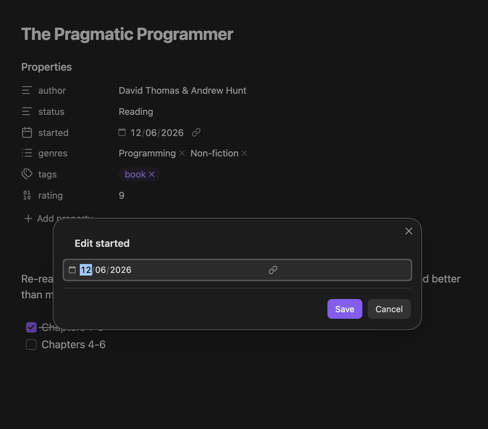
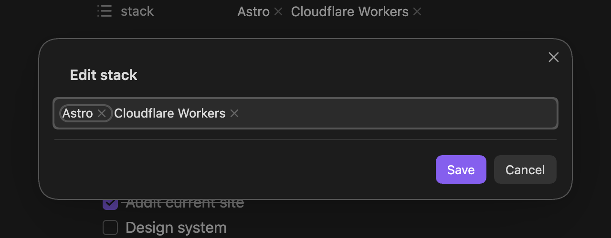

Pick a property from MetaEdit's property picker and the right editor opens on its own: since 1.9.0, most YAML frontmatter properties get the exact widget Obsidian's Properties view would use - a date picker for dates, a checkbox for booleans, chips for lists. This page explains which editor opens for what, and the safety rules behind every write.

## Open the picker

Run "MetaEdit: Run" from the command palette on an open note, or right-click a note in the file explorer (or an internal link) and choose "Edit Meta". Both open the same property picker; see the [quick start](/getting-started/quick-start/) for a tour and [commands and menus](/reference/commands-and-menus/) for every entry point.

## Which editor opens

MetaEdit routes each row through a fixed precedence ladder. The first match wins:

| Precedence | You picked | What opens |
| --- | --- | --- |
| 1 | A body `#tag` row | The tag action flow - see [edit tags](/guides/edit-tags/) |
| 2 | A key with an active [Auto Property](/guides/auto-properties/) | The Auto Property value prompt. Auto Properties win over everything else |
| 3 | Any other top-level YAML property | The "Edit {key}" modal with Obsidian's native widget - the rest of this page |
| 4 | An inline Dataview field or non-native YAML value, when [Edit Mode](/guides/lists-and-multi-values/) says it is multi-value | The multi-value list editor - see [work with lists](/guides/lists-and-multi-values/) |
| 5 | Everything else (inline fields, nested dot-path values) | A text prompt titled "Enter a new value for {key}" |

Auto Property matching is exact and case-sensitive, and only applies while the Auto Properties feature is enabled in settings.

:::note
Real YAML lists and the frontmatter `tags` key are top-level YAML properties, so they take route 3: the native list widget and Obsidian's tags widget, not the legacy list editor. Edit Mode plays no part in that - it governs inline fields, non-native YAML scalars, and the legacy add paths. Details in [work with lists and multi-value properties](/guides/lists-and-multi-values/).
:::

## The native editor

Selecting an eligible YAML property opens a modal headed "Edit {key}" - for a property named `started`, it reads "Edit started" - containing the same widget Obsidian's Properties view uses for that key:

A list property gets the chip editor instead:

The widget is chosen the way Obsidian itself would choose it: the type you assigned in Obsidian's Properties UI wins, then the vault-wide property info, then Obsidian's expected type for the key, and finally the shape of the current value (an array opens the List widget, a boolean the Checkbox, a number the Number field, an ISO date the Date or Date & time picker). Reserved keys resolve by name: `tags` opens Obsidian's tags pill widget, `aliases` the aliases widget, and `cssclasses` its list widget.

Two buttons finish the edit:

- "Save" writes the widget's value to frontmatter. Values keep their real types - a date stays a date, a number stays a number, a list stays a list. Nothing is retyped into a string.
- "Cancel" (or closing the modal) writes nothing.

If you never touch the widget, "Save" also writes nothing - an untouched editor never modifies the file.

:::tip[Wikilinks in aliases]
The aliases widget gets an extra: type `[[` followed by part of a note name inside a chip, and a dropdown suggests link targets from your vault. Picking one inserts a properly formed link relative to the current note.
:::

## What is eligible

Native editing covers top-level YAML frontmatter properties. Three kinds of rows fall outside it:

- **Nested values.** A dot-path row like `parent.child` or `items[0].name` is edited through the text prompt, not a native widget.
- **Parent containers.** A key whose value is an object, or a list containing objects or lists, cannot be edited as a single value. These rows do not appear in the picker at all; if one is ever targeted anyway, MetaEdit refuses with the notice "Nested YAML parent '{key}' cannot be edited as a text value."
- **Inline Dataview fields.** `key:: value` fields live in the note body, not frontmatter, so they use the text prompt or the list editor depending on Edit Mode.

See [what MetaEdit can (and can't) edit](/concepts/what-metaedit-can-edit/) for the full model.

## Safety guards

Every native edit is guarded so a race or a widget failure can never corrupt your note:

- **Stale-value guard.** Before writing, MetaEdit verifies the property still holds the value the modal opened with. If the note changed underneath you - another plugin, a sync, your own edit in another pane - the write is refused with "MetaEdit could not update '{key}': current value changed before update." Reopen the picker and try again.
- **Fail-closed on missing values.** If you typed into the widget but it never reported a value back to MetaEdit, "Save" refuses with "MetaEdit did not receive a value from Obsidian's native editor for '{key}'. Nothing was written." and the modal stays open.
- **Render failures block the write.** If the widget fails to render, the modal shows "MetaEdit could not render Obsidian's native editor for '{key}'." and disables "Save" entirely.
- **Serialized writes.** All MetaEdit writes to one file run through a per-file queue, so concurrent operations apply in order instead of losing updates. See [how MetaEdit writes to your notes](/concepts/write-safety/).

:::caution[Plain-text fallback]
Native widgets rely on Obsidian internals available from Obsidian 1.12.7, which is why MetaEdit requires that version. If a widget is unavailable anyway, the "Edit {key}" modal degrades to a plain text input with an explanatory note such as "Obsidian native property widgets are not available." You can still save, but values committed through the fallback are written as strings.
:::

## The text prompt

Rows with no richer editor - inline Dataview fields under the default Edit Mode, and nested dot-path values - open a prompt titled "Enter a new value for {key}", pre-filled with the current value. Where Obsidian's metadata cache knows values already used for the property elsewhere in the vault, the prompt suggests them in a dropdown, most-used first. Inline Dataview field values are not indexed by Obsidian, so inline fields currently get no value suggestions.

Submitting an empty value or pressing Escape changes nothing.

:::note
Updating an inline Dataview field rewrites the value of every field with that name in the note, not just one occurrence. The keys, surrounding text, and any `[...]` or `(...)` wrappers stay exactly as they were.
:::

## Related pages

- [Create new properties](/guides/create-properties/) - the "New YAML property" and "New Dataview field" rows.
- [Work with lists and multi-value properties](/guides/lists-and-multi-values/) - the list widget, the legacy list editor, and Edit Mode.
- [Auto Properties](/guides/auto-properties/) - reusable value sets that take precedence over every other editor.
- [Delete and transform properties](/guides/delete-and-transform/) - the row action icons next to each property.
