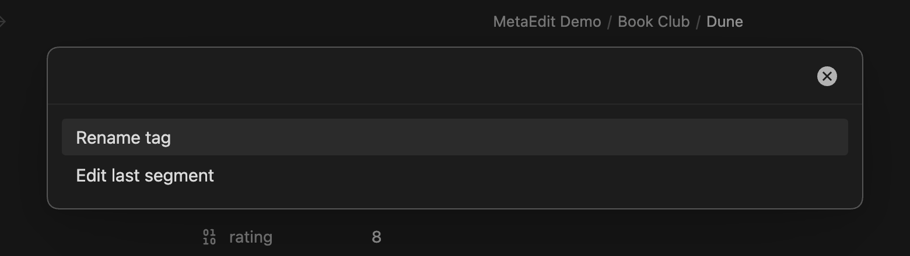

Tags live in two places in a note, and MetaEdit edits both: body `#tags` are renamed one occurrence at a time, directly in the text, while a frontmatter `tags:` property is edited as a list through Obsidian's native tags widget. This page covers both paths, plus the Obsidian Tracker integration and the safety rules behind every tag write.

## Two homes for tags

| Home | Example | How MetaEdit edits it |
| --- | --- | --- |
| Body tag | `#reading` in the note text | Each occurrence is its own row in the property picker; an edit rewrites exactly that occurrence |
| Frontmatter tags | `tags: [sci-fi, book-club]` in Properties | A normal YAML property row that opens Obsidian's native tags widget |

The two homes are edited independently: renaming a body `#tag` never touches the frontmatter `tags:` list, and vice versa. For the full model, see [what MetaEdit can (and can't) edit](/concepts/what-metaedit-can-edit/).

## Pick a body tag occurrence

Run "MetaEdit: Run" (or right-click a note and choose "Edit Meta") to open the property picker. Every body `#tag` occurrence in the note appears as its own row - tags inside code blocks are excluded, because Obsidian does not index them as tags.

When the same tag appears more than once, rows are disambiguated with the line and an occurrence ordinal, for example `#dup (line 3, 1/2)`. Even two identical tags on the same line get distinct rows, so you always know which occurrence you are about to edit.

The picker footer states the scope: "#tag - rename in this note · vault-wide: Tag pane". A body-tag edit changes exactly one occurrence in one note. For vault-wide renames, use Obsidian's Tag pane instead (see [what MetaEdit deliberately does not do](#what-metaedit-deliberately-does-not-do-with-tags)).

:::note
Body tag rows never show the "Delete property" or "Transform to YAML ⇄ Dataview" icons. Those actions operate on a `key:` line, which a body tag does not have, so 1.9.0 removed them from tag rows rather than let them silently no-op or mangle the tag. See [delete and transform properties](/guides/delete-and-transform/) for where they do apply.
:::

To hide body tag rows from the picker entirely, enable "Hide file tags" under the "Edit Meta menu" section in settings - the frontmatter `tags:` property stays editable. See the [settings reference](/reference/settings/).

## Choose an action

Selecting a body tag row opens an action chooser with up to three actions:



| Action | When it appears |
| --- | --- |
| "Rename tag" | Always |
| "Edit last segment" | Only for nested tags containing `/`, like `#area/projects` |
| "Tracker value (#tag:value)" | Only when the obsidian-tracker plugin is installed |

If only one action applies - a flat tag, with Tracker not installed - the chooser is skipped and the rename prompt opens directly.

## Rename a tag

The rename prompt is headed "Rename #tag to" and is pre-filled with the current tag name, without the `#`. Whatever you type becomes the whole new tag: MetaEdit strips any leading `#` you type and writes exactly one. Nested input is honored, so typing `books/sci-fi` over `#reading` produces `#books/sci-fi`.

The prompt autocompletes from the full tag names already used in your vault, ranked with the most-used tags first:


Pressing Escape, submitting a blank value, or submitting the unchanged name does nothing.

:::caution[Changed in 1.9.0]
Renaming replaces the whole tag. The legacy behavior appended your input as a child segment, turning `#book` plus `fantasy` into `#book/fantasy`. Since 1.9.0, a flat tag is renamed, never nested - to nest a tag, type the full nested name (`book/fantasy`). See [what's new in 1.9.0](/getting-started/whats-new/).
:::

## Edit the last segment of a nested tag

For a nested tag like `#area/projects/x`, "Edit last segment" replaces only the final `/`-segment and keeps the parent path. The prompt is headed "Change the last segment of #area/projects/x to" and is pre-filled with the current leaf (`x`); typing `y` yields `#area/projects/y`. Suggestions in this mode are the leaf segments of all vault tags, again ranked by usage.

:::tip[Auto Property hook]
If an [Auto Property](/guides/auto-properties/) exists whose name is the tag's parent path including the leading `#` - for example an Auto Property named `#area/projects` for the tag `#area/projects/x` - its value prompt supplies the new leaf instead of the free-text prompt. Only a single value can become the new segment: with a Multi Auto Property, checking more than one value produces a comma-joined result that fails tag validation, so MetaEdit refuses the write with the invalid-tag-name notice. Use a Single-type Auto Property for tag-segment hooks. The leading `#` in the Auto Property name is required for the match, and Auto Properties must be enabled in settings.
:::

## Write a Tracker value

If the community plugin [Obsidian Tracker](https://github.com/pyrochlore/obsidian-tracker) is installed, the action chooser offers "Tracker value (#tag:value)". It writes Tracker's inline data syntax over the tag occurrence: choose it on `#weight`, type `80` into the "Enter a Tracker value for #weight" prompt, and the occurrence becomes `#weight:80`.

Re-editing a tag that already carries a value replaces the old suffix instead of stacking: `#weight:80` becomes `#weight:85`, never `#weight:85:80`. Only the value token itself is replaced - adjacent punctuation like a comma or closing parenthesis is never consumed. Submitting an empty value cancels.

A few boundaries:

- Tracker values apply to body tags only; frontmatter tags never get `:value` syntax.
- MetaEdit checks for the Tracker plugin when it loads, so after installing or removing Tracker, reload MetaEdit (or restart Obsidian) for the action to appear or disappear.
- Tag autocomplete is deliberately off in this prompt - a Tracker value is data, not a tag name.

For a full workflow built on this, see [track daily metrics with Tracker tags](/cookbook/tracker-metrics/).

## Validation and safety

MetaEdit refuses to write a broken tag into your note. A new tag name must be one `#` followed by only letters, digits, `_`, `-`, and `/`, with at least one non-digit character:

- Spaces, commas, periods, and other punctuation are rejected, because they end a tag in Obsidian - splicing them in would break the tag mid-name. The notice reads: `'{input}' is not a valid tag name. Tags cannot contain spaces or commas.`
- Purely numeric tags like `#2024` are rejected, because Obsidian renders them as plain text, not tags.

Every body-tag edit rewrites only the exact character span of the chosen occurrence - surrounding prose, other tags on the same line, and every other byte stay untouched. Before writing, MetaEdit re-checks that the span still holds the tag you selected. If the note changed underneath the open picker, the write is refused with:

```text
MetaEdit could not update '#tag': could not locate the tag '#tag' to edit - the note may have changed since it was opened. Reopen and try again.
```

Nothing is written in that case; run "MetaEdit: Run" again and retry. All tag writes go through the same per-file write queue as every other MetaEdit edit - see [how MetaEdit writes to your notes](/concepts/write-safety/).

## Edit frontmatter tags

A frontmatter `tags:` key shows up in the picker as a normal YAML property row, not a `#tag` row. Selecting it opens Obsidian's own tags widget - the same pill UI with vault-aware tag autocomplete you get in the Properties panel - inside a MetaEdit modal. A legacy `tag:` key opens a regular native widget instead - the List or text widget, per Obsidian's inferred type - without tag autocomplete. See [edit properties with native widgets](/guides/edit-properties/) for how native editing works in general.

Outside the native widget - the [public API](/api/properties/), [Auto Properties](/guides/auto-properties/), property creation, and [transforms](/guides/delete-and-transform/) - MetaEdit canonicalizes every write to a `tags`/`tag` key:

- Any leading `#` is stripped; Obsidian stores frontmatter tags without it.
- Comma- or whitespace-separated strings are split into individual tags, so `sci-fi, book-club` becomes two entries.
- The result is always stored as a YAML list, Obsidian's canonical form.
- Deleting the last tag removes the `tags:` key entirely rather than leaving a dangling `tags:` or `tags: []`.

Creating a new property named `tags` or `tag` through "New YAML property" locks to the native tags widget - no type choice is offered. And if an Auto Property named `tags` exists, it takes precedence over the native widget, as it does for every property.

## What MetaEdit deliberately does not do with tags

These are design boundaries, not gaps:

- **No vault-wide rename or merge.** A body-tag edit touches one occurrence in one note. Obsidian's Tag pane owns cross-vault renames, and the picker footer points there.
- **No deleting or transforming body tags.** A body tag has no `key:` line for those actions to operate on safely.
- **No linked rename across both homes.** Body `#tags` and frontmatter `tags:` are edited independently; changing one never changes the other.
- **No custom tags UI for frontmatter.** MetaEdit mounts Obsidian's own tags widget instead of re-implementing it.
