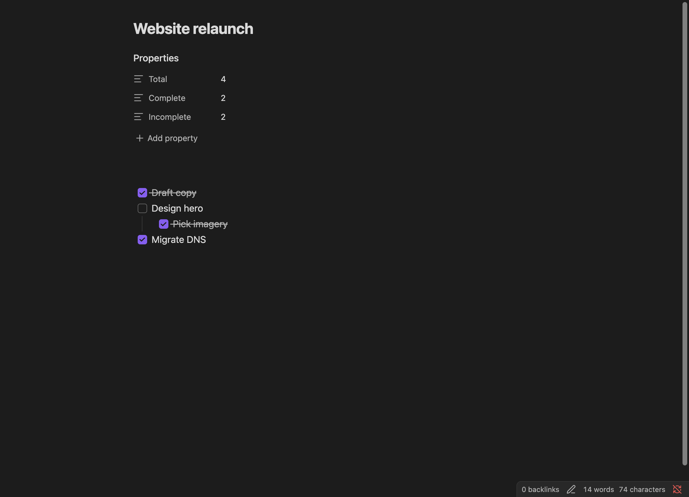

Progress Properties keeps task counts in your notes current without you touching them. Enable it, tell MetaEdit which property names hold which count, and about 5 seconds after you stop editing a note its counts are rewritten to match the checklist.

This works for YAML frontmatter properties and [inline Dataview fields](/concepts/what-metaedit-can-edit/) alike, on desktop and mobile.

## Set it up

1. Open Settings and go to the MetaEdit tab.
2. Turn on the "Progress Properties" toggle. It takes effect immediately, no restart needed.
3. Click the row's gear button to expand the configuration table (columns "Name" and "Type").
4. Click "Add", type your property key into the "Property name" field, and pick a type from the dropdown: "Total Tasks", "Completed Tasks", or "Incomplete Tasks" (new rows default to "Total Tasks").
5. Remove a row with its red cross button. Every change saves immediately.


The property names are yours to choose - `Total`, `done`, `tasks-left`, anything. What matters is the type you pair each name with. Name matching is exact and case-sensitive: a configured `Total` will not update a note's `total`.

:::caution[Add the property to each note yourself]
MetaEdit only updates properties that already exist. It never creates them. Before the counts can update, add the property to the note on your own - for example `Total: 0` in frontmatter or `Total:: 0` as an inline field. A note without the configured property is silently skipped. The [create properties guide](/guides/create-properties/) shows the fastest ways to add one.
:::

## Counting rules

| Type | What it counts |
| --- | --- |
| "Total Tasks" | Every checklist item in the note, whatever its marker, including nested sub-tasks |
| "Completed Tasks" | Only items checked as `[x]` or `[X]` |
| "Incomplete Tasks" | Total minus completed |

Custom markers such as `[/]`, `[-]`, `[>]`, and `[?]` are not complete, so they count as incomplete. Counts are written as text (strings), not numbers: a count of 4 lands in frontmatter as `"4"`.

## Example: before and after

Configure three rows: `Total` as "Total Tasks", `Complete` as "Completed Tasks", `Incomplete` as "Incomplete Tasks". Then take this note:

```md
---
Total: 0
Complete: 0
Incomplete: 0
---

# Website relaunch

- [x] Draft copy
- [ ] Design hero
	- [x] Pick imagery
- [/] Migrate DNS
```

About 5 seconds after your last edit, the frontmatter becomes:

```yaml
---
Total: "4"
Complete: "2"
Incomplete: "2"
---
```

Four items in total (the nested sub-task counts), two checked `[x]`, and two incomplete - the unchecked item plus the `[/]` in-progress marker.



## How and when updates run

Progress Properties and the [Kanban Board Helper](/guides/kanban-helper/) share one background pipeline. The same gates apply to both:

- Runs are triggered by Obsidian's file-modify event only. Merely opening a note does nothing, and changes made outside Obsidian's own file operations are not picked up.
- Only markdown files qualify.
- The note must have YAML frontmatter, even if the tracked property is an inline field. A note with no frontmatter block is never processed.
- Excalidraw notes are skipped (any frontmatter key containing "excalidraw" is excluded, to avoid fighting Excalidraw's auto-save).
- If the note's content is identical to what was last processed, nothing runs.
- Runs are debounced by 5 seconds, and the timer resets while you keep typing. Updates land 5 seconds after your last qualifying change.
- Neither automator ever creates a property. Both only update ones that already exist.

Both features are off by default, and their toggles take effect the moment you flip them. All writes go through MetaEdit's usual safe write path - see [write safety](/concepts/write-safety/).

## Troubleshooting

Counts never update? Check these in order:

1. The property does not exist in the note yet. Add it yourself - MetaEdit will not create it.
2. The name does not match exactly. Matching is case-sensitive: `total` and `Total` are different properties.
3. The note has no YAML frontmatter. Even inline-field tracking requires a frontmatter block to exist.
4. You are still within the 5-second debounce, which resets while you type. Stop editing and wait a moment.
5. The "Progress Properties" toggle is off, or no rows are configured in its table.

One subtlety: a note whose body contains no list items at all is left untouched, but a note with a bullet list and zero checkboxes gets counts of 0 written to its configured properties. If something fails during an update, MetaEdit shows a notice prefixed `MetaEdit: (ERROR)` - see the [notices reference](/reference/notices/).

For a complete tour of the settings tab, see the [settings reference](/reference/settings/). For a worked project-tracking setup, see the [task dashboard recipe](/cookbook/task-dashboard/).
