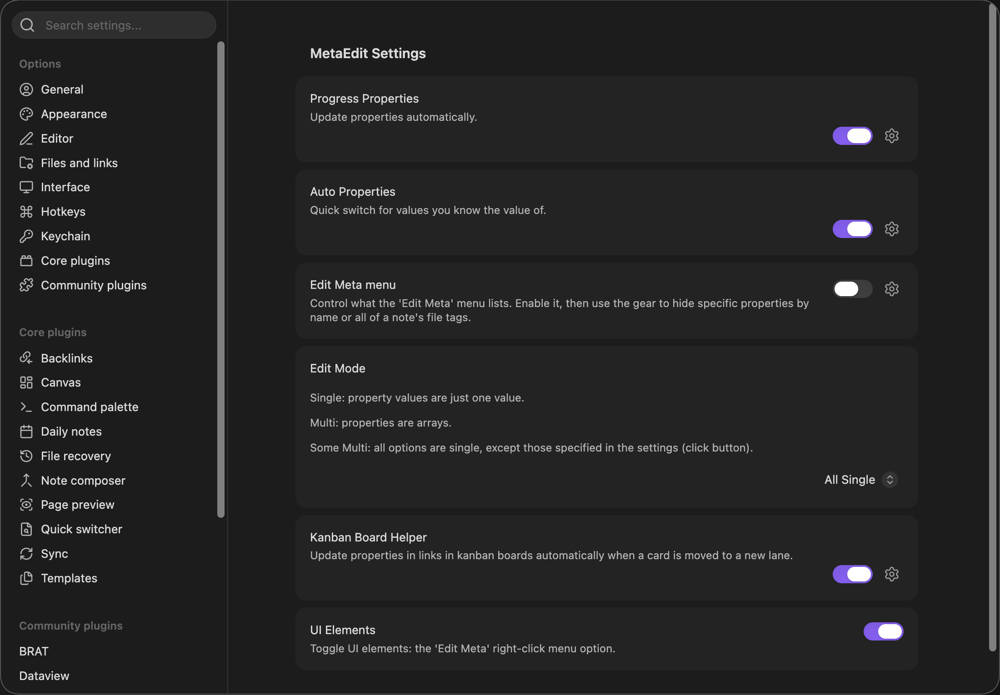
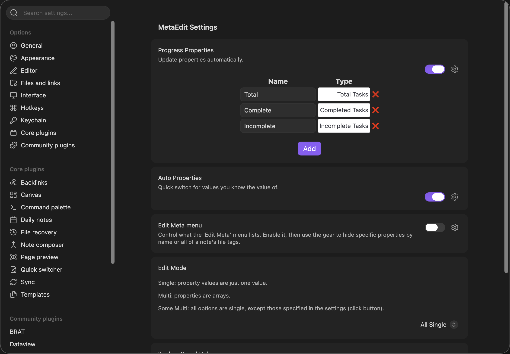
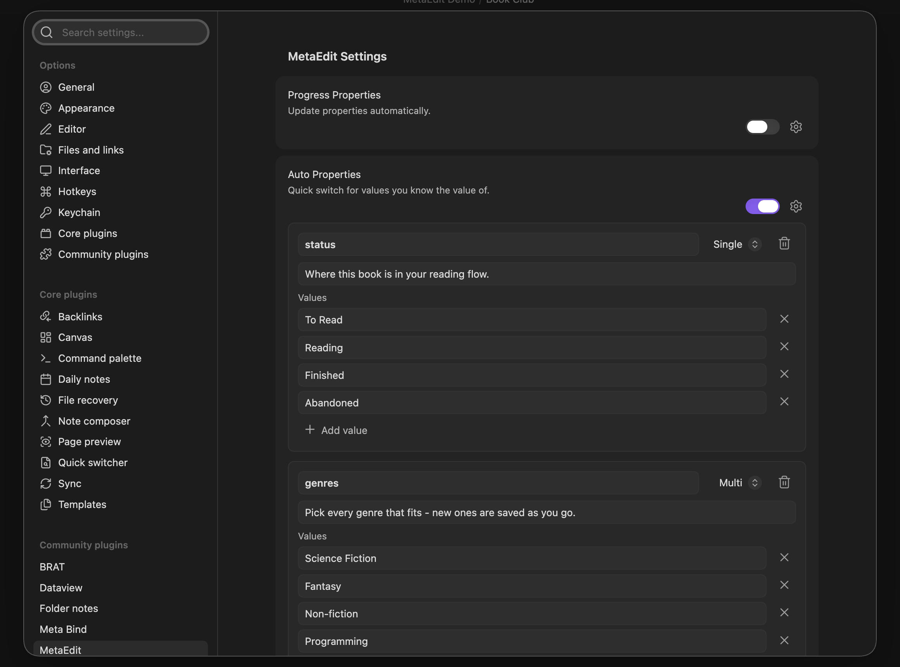
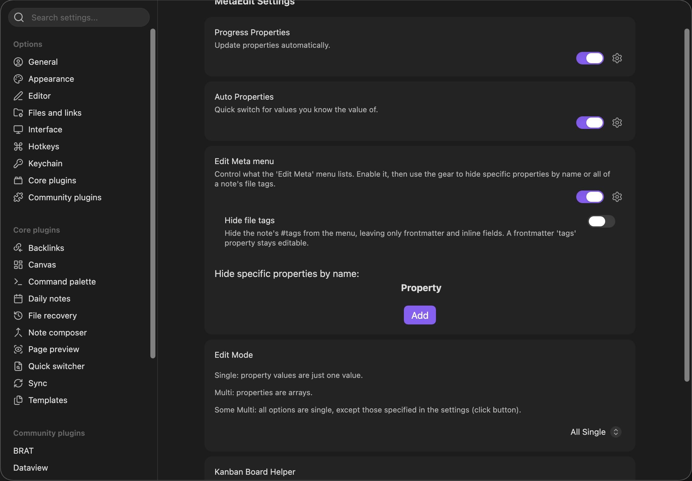
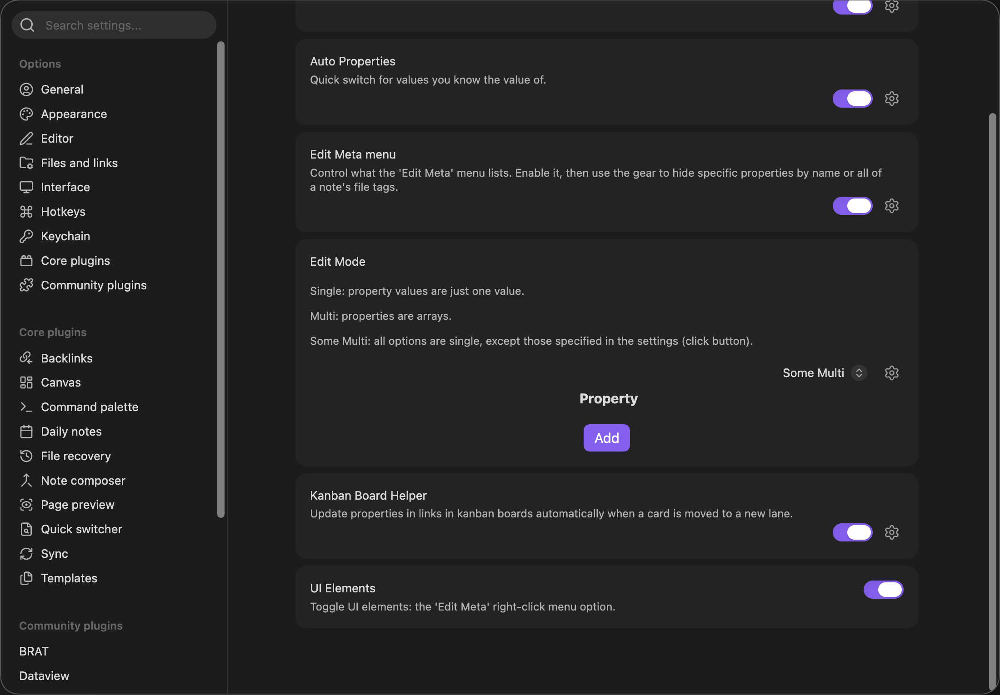
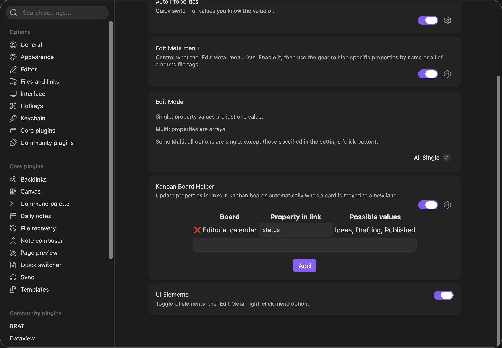

This page documents every MetaEdit setting in the fixed order the tab shows them, with each setting's exact name, description, default, and what its configuration panel contains. Open them under Settings, in the "MetaEdit" tab, headed "MetaEdit Settings".

Two things apply everywhere:

- **Changes save immediately.** There is no Save button anywhere in the tab, and writes are serialized. Edits inside the Auto Properties panel additionally roll back and show a notice if the save fails.
- **Panels open inline.** Every setting except "UI Elements" and "Edit Mode" has an extra icon button on its row (the "Edit Meta menu" description calls it "the gear") that expands a configuration panel below the toggle; "Edit Mode" shows its button only while "Some Multi" is selected. Panels start collapsed.

### Defaults at a glance

| Setting | Default | Takes effect |
| --- | --- | --- |
| "Progress Properties" | Off | Immediately (attaches the automator live) |
| "Auto Properties" | Off | Immediately |
| "Edit Meta menu" | Off | Next time the picker opens |
| "Edit Mode" | "All Single" | Immediately |
| "Kanban Board Helper" | Off | Immediately (attaches the automator live) |
| "UI Elements" | On | Immediately (registers or unregisters the menus live) |

"UI Elements" is the only setting that defaults to enabled.

## Progress Properties

- **Description:** "Update properties automatically."
- **Toggle tooltip:** "Toggle Progress Properties". Default off.

Enables the [Progress Properties](/guides/progress-properties/) automator, which keeps task-count properties in your notes up to date. Toggling attaches or detaches the automator immediately - no reload needed.

The panel is a table with columns "Name" and "Type". Each row pairs:

- a text input (placeholder "Property name") for the property key in your notes,
- a dropdown with exactly three types: "Total Tasks", "Completed Tasks", "Incomplete Tasks",
- a "❌" button that removes the row.

The "Add" button appends a new row with the type defaulting to "Total Tasks". New rows start with an empty name and nothing validates the name before saving, so fill it in right away. Property names match exactly and case-sensitively, and the automator only updates properties that already exist in a note - it never creates them.

## Auto Properties

- **Description:** "Quick switch for values you know the value of."
- **Toggle tooltip:** "Toggle Auto Properties". Default off.

Enables [Auto Properties](/guides/auto-properties/): predefined value sets that replace free-text prompts when you edit or create a matching property. While the toggle is off, no Auto Property activates anywhere, including the `autoprop()` [API call](/api/auto-properties/).

With no properties defined, the panel shows: "No auto properties yet. Add one to define a reusable set of values for a property." Each auto property renders as a card containing:

| Control | Details |
| --- | --- |
| Name input | Placeholder "Property name". Matched exactly and case-sensitively against property keys |
| Type dropdown | "Single" or "Multi" (new properties start as "Single") |
| Remove button | Trash icon, "Remove this auto property" |
| Description input | Placeholder "Description (shown when you pick a value) - optional" |
| "Values" list | One text input per choice, placeholder "Value (or paste a list)", each with an x "Remove value" button |
| "Add value" | Appends an empty value box |

At the bottom of the panel, "Add auto property" appends a new card. There is no reorder control; new items always append at the end.

**Paste a whole list:** pasting into a value box splits the text into individual choices - on lines when the text contains any line break, otherwise on commas. Tokens are trimmed, blanks dropped, and duplicates skipped. A paste that yields fewer than two tokens behaves like a normal paste.

If a save fails, the change is rolled back and a notice appears: "MetaEdit could not save the Auto Properties setting: {reason}".

## Edit Meta menu

- **Description:** "Control what the 'Edit Meta' menu lists. Enable it, then use the gear to hide specific properties by name or all of a note's file tags."
- **Toggle tooltip:** "Toggle menu filtering". Default off.

Filters which rows the [property picker](/reference/commands-and-menus/#the-property-picker) lists. While the master toggle is off, nothing is filtered - the gear panel only exists while the toggle is on.

The panel contains two controls:

- **"Hide file tags"** (tooltip "Toggle hiding file tags", default off). Description: "Hide the note's #tags from the menu, leaving only frontmatter and inline fields. A frontmatter 'tags' property stays editable." It removes only body `#tag` rows from the picker.
- **"Hide specific properties by name:"** - a table of property names (placeholder "Property name", "❌" removers, "Add" button). A property is hidden when its key exactly matches a listed name; matching is case-sensitive, with no wildcards.

Filtering only hides picker rows - it never deletes anything from your notes. Hidden-but-present keys are also excluded from the "New YAML property" and "New Dataview field" name suggestions, so you cannot accidentally re-create a key the note already has.

:::note[Upgrading from an older MetaEdit]
This feature was previously named "Ignored Properties", and its storage key in `data.json` is still `IgnoredProperties`. Old versions applied the ignore list even while the feature toggle was off, so on first load after upgrading, a vault with the feature disabled but a non-empty ignore list gets the toggle switched on once, automatically. That preserves your previous filtering; turn it off afterwards if you no longer want it, and it will stay off.
:::

## Edit Mode

- **Description:** "Single: property values are just one value. Multi: properties are arrays. Some Multi: all options are single, except those specified in the settings (click button)."
- **Dropdown values:** "All Single" (default), "All Multi", "Some Multi".

Controls whether property values are edited (and created, on the legacy paths) as single values or as lists. See [lists and multi-values](/guides/lists-and-multi-values/) for the full routing rules.

While "Some Multi" is selected, an extra button appears (tooltip "Configure which properties are Multi."). It opens a table of property names (placeholder "Property name", "❌" removers, "Add") listing the properties treated as Multi. Choosing "All Single" or "All Multi" hides the button and the panel, but the stored list persists across mode switches - it comes back when you return to "Some Multi".

:::note[Where Edit Mode applies]
Edit Mode does not apply to YAML properties edited or created with Obsidian's native widgets - it governs inline Dataview fields, non-native YAML scalars, and the legacy add paths (transform to YAML, the API's `createYamlProperty`, and [bulk edit](/guides/bulk-edit/)). YAML lists are inherently multi-value whatever the mode says: a real top-level frontmatter list opens Obsidian's native list widget, and a non-native YAML list (for example a nested array) always uses the legacy list editor - see [work with lists and multi-value properties](/guides/lists-and-multi-values/). An [Auto Property](/guides/auto-properties/) with an explicit "Single" or "Multi" type also overrides Edit Mode for its key.
:::

## Kanban Board Helper

- **Description:** "Update properties in links in kanban boards automatically when a card is moved to a new lane."
- **Toggle tooltip:** "Toggle Kanban Helper". Default off.

Enables the [Kanban Board Helper](/guides/kanban-helper/) automator. Toggling attaches or detaches it immediately.

The panel is a table with columns "Board", "Property in link", and "Possible values" (plus an unlabeled remove column):

- **"Board"** - the board file's basename.
- **"Property in link"** - a text input (placeholder "Property name") for the property to update in the notes the board's cards link to.
- **"Possible values"** - read-only; the board's lane headings joined by ", ", or "FILE NOT FOUND" if the configured board file no longer exists (a "file {name} not found." warning also appears).

Below the table, a text input with autocomplete suggests Kanban boards - markdown files whose frontmatter contains a `kanban-plugin` key, in practice boards created by the community Kanban plugin. The "Add" button adds a row only when the typed text exactly matches a suggested board basename that is not already configured; otherwise it silently does nothing. The board list is computed when the settings tab renders, so boards created afterwards need the tab reopened.

## UI Elements

- **Description:** "Toggle UI elements: the 'Edit Meta' right-click menu option."
- **Toggle tooltip:** "Toggle UI elements". Default on.

The only setting without a panel. It gates all three context-menu items - "Edit Meta" plus both bulk edit items - even though the description mentions only "Edit Meta". Turning it off unregisters the menu handlers immediately; turning it on brings them back, no restart needed. See [commands and menus](/reference/commands-and-menus/#context-menu-items).

## Related pages

- [Commands and menus](/reference/commands-and-menus/) - the entry points these settings shape
- [Notices and error messages](/reference/notices/) - settings-related notices
- [Troubleshooting](/help/troubleshooting/) - when a setting does not seem to take effect
